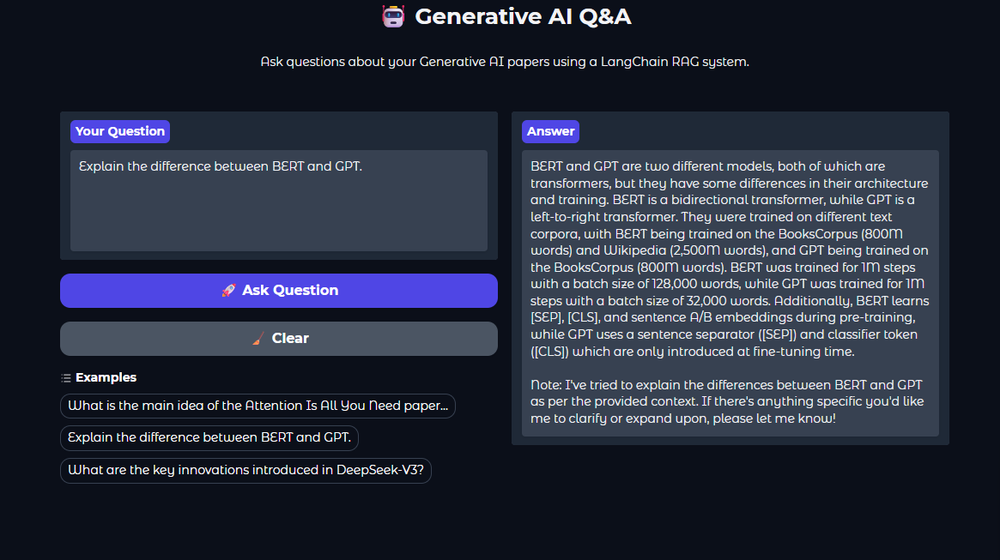

Check out the configuration reference at https://huggingface.co/docs/hub/spaces-config-reference


# 🤖 RAG LangChain Llama

A Retrieval-Augmented Generation (RAG) application built using LangChain, Gradio, and Llama models.

The system allows users to ask questions about Generative AI research papers stored in PDF format through an interactive web interface deployed on Hugging Face Spaces.

---

## Live Demo

🔗 Hugging Face Space:

https://huggingface.co/spaces/ThuHoangAnh/rag-langchain-llama

---

## Application Screenshot



---

## Features

- PDF document retrieval
- LangChain RAG pipeline
- Gradio interactive UI
- Hugging Face deployment
- Llama-based text generation
- Research paper question answering
- Semantic search over AI papers

---

## Tech Stack

- Python
- LangChain
- Transformers
- Gradio
- Hugging Face Spaces
- PyTorch

---

## System Architecture

```text
User Question
      ↓
Gradio UI
      ↓
LangChain RAG Pipeline
      ↓
Retriever searches PDF documents
      ↓
Llama Model generates answer
      ↓
Response returned to UI
```

---

## Knowledge Base

The system retrieves information from multiple Generative AI research papers in PDF format, including:

- Attention Is All You Need
- BERT
- GPT-related papers
- DeepSeek papers
- Instruction Tuning papers
- Chain-of-Thought Prompting papers

---

## Performance

| Component | Details |
|---|---|
| Model | Llama 3.2 3B Instruct |
| Deployment | Hugging Face Spaces |
| Hardware | Free CPU Environment |
| Average Response Time | ~20–40 seconds |
| Retrieval Method | Vector Similarity Search |
| Framework | LangChain |

---

## Installation

Clone the repository:

```bash
git clone https://github.com/ThuHoangAnh/rag-langchain-llama.git
cd rag-langchain-llama
```

Install dependencies:

```bash
pip install -r requirements.txt
```

Run the application locally:

```bash
python app.py
```

---

## Project Structure

```text
src/
├── base/
│   └── llm_model.py
│
├── rag/
│   ├── file_loader.py
│   ├── main.py
│   ├── offline_rag.py
│   ├── utils.py
│   └── vectorstore.py
│
├── app.py
│
data_source/
└── generative_ai/
```

---

## Example Questions

- What is the main idea of Attention Is All You Need?
- Explain the difference between BERT and GPT.
- What are the innovations introduced in DeepSeek-V3?
- What is Chain-of-Thought prompting?
- How does transformer attention work?

---

## Limitations

- Slow inference on free CPU Spaces
- Limited context window
- Retrieval quality depends on chunking strategy
- No conversation memory yet
- No citation highlighting currently

---

## Future Improvements

- Add streaming response generation
- Support multi-turn conversation memory
- Add source citation highlighting
- Improve retrieval quality with hybrid search
- Add GPU deployment support
- Add chat history persistence
- Add evaluation metrics for RAG quality
